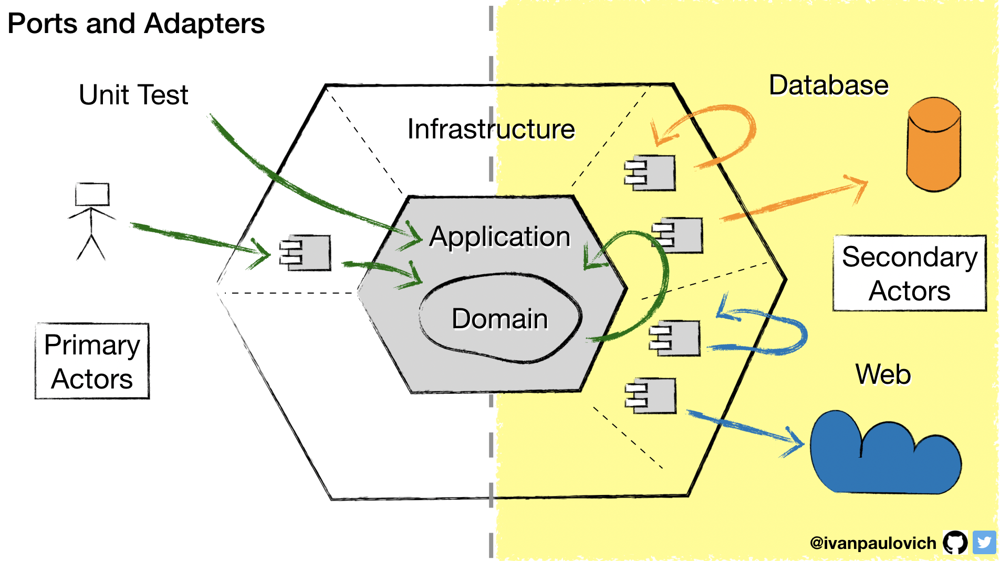
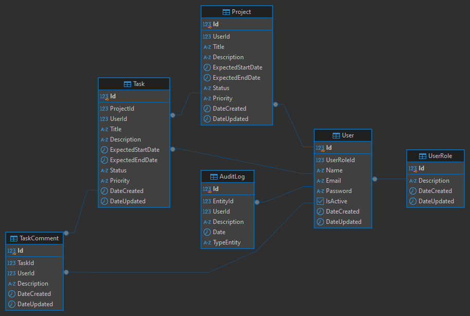

# Eclipse - Gerenciamento de Projetos e Tarefas

Este projeto tem como objetivo desenvolver uma aplicação para gerenciamento de projetos e tarefas voltada para equipes de tecnologia. A aplicação permitirá que os membros do time gerenciem seus projetos de forma eficiente, organizando e acompanhando as tarefas dentro de cada projeto, com funcionalidades que otimizam a colaboração e o desempenho da equipe.
Inspirado no repositório [Clean Architecture Manga](https://github.com/ivanpaulovich/clean-architecture-manga), o projeto adota uma arquitetura robusta e escalável, visando a criação de uma aplicação bem estruturada e fácil de manter. Através dessa abordagem, buscamos garantir um código de alta qualidade, com separação de preocupações e aplicação de boas práticas de design de software.

## Tecnologias Utilizadas

- **.NET 8 Web API**: Para construção da API.
- **PostgreSQL**: Banco de dados relacional para armazenamento de dados.
- **Testcontainers**: Para testes de integração com contêineres.
- **Swagger**: Documentação da API e versionamento.
- **Microsoft Extensions**: Para configuração e extensão da aplicação.

## Arquitetura

Este projeto adota princípios de **Clean Architecture**, **Onion Architecture** e **Hexagonal Architecture**, promovendo uma clara **Separação de Preocupações**. A estrutura é dividida em:

- **Domain**: Contém as entidades e regras de negócio.
- **Application**: Contém casos de uso e lógicas de aplicação.
- **Infrastructure**: Implementações concretas como acesso a dados.
- **User Interface**: Interface do usuário, onde a API é exposta aos clientes.

## Recursos

- **EF Core**: Para acesso a dados com um padrão de repositório.
- **Feature Flags**: Para ativação/desativação de funcionalidades em tempo real.
- **Logging**: Implementação de registro de logs para monitoramento e depuração.
- **Data Annotation**: Validação de dados nos modelos.

## Padrões e Práticas

- **SOLID**: Princípios de design que orientam a estruturação do código.
- **Unit Of Work**: Padrão para gerenciar transações.
- **Repository**: Padrão de projeto que abstrai a lógica de acesso a dados.
- **Use Case**: Organização das operações da aplicação.
- **Presenter Custom**: Lógica para formatação e apresentação dos dados.

## Testes

- **API Test**: Conjunto de testes automatizados para garantir a funcionalidade da API.
- **Testcontainers**: Usado para testes de integração com ambientes isolados.

## Instalação Docker e Clone
1. **Certifique-se de que o Docker esteja instalado em sua máquina.** 
Você pode baixar e instalar o Docker [aqui](https://www.docker.com/get-started).
2. **Clone o repositório:**
git clone https://github.com/henriqueandradesilva/eclipse.git

## Configuração e Execução (Apenas Prompt)
Para executar o projeto pelo terminal, siga os passos abaixo:
1. **Abra o terminal e navegue até o diretório do projeto**
Certifique-se de que você está no diretório raiz onde o arquivo .sln e o docker-compose.yml estão localizados, Exemplo:
cd /caminho/para/projeto
2. **Compile o projeto usando o dotnet build**
Antes de rodar os containers, compile a solução para garantir que não haja erros no código, Exemplo:
dotnet build
3. **Execute o Docker Compose**
Use o comando abaixo para iniciar o ambiente do Docker, Exemplo:
docker-compose up -d
4. **Acesse a documentação Swagger:**
Abra o navegador e acesse: https://localhost:600100/swagger/index.html.

## Configuração e Execução (Com Visual Studio)

1. **Abra a solução no Visual Studio:**
Localize e abra o arquivo Eclipse Solution.sln.
2. **Defina o projeto docker-compose como o projeto de inicialização:** 
Clique com o botão direito no projeto docker-compose no Gerenciador de Soluções e selecione "Definir como Projeto de Inicialização".
3. **Execute a aplicação:** 
Pressione F5 ou clique em "Iniciar" para executar a aplicação.
4. **Acesse a documentação Swagger:**
Abra o navegador e acesse: https://localhost:600100/swagger/index.html.

## Coleção Postman

Esta coleção contém as requisições para a API. 

*Arquivo: [Coleção Postman](./documents/WebApi.postman_collection.json)*

## Padrão de Arquitetura

Aqui está uma visão geral da arquitetura do sistema.

## Diagrama de Entidade Relacionamento (DER)

O diagrama abaixo ilustra as entidades e seus relacionamentos.

.NET (C#)
Visão geral:
O time de desenvolvimento de uma empresa precisa de sua ajuda para criar um sistema de gerenciamento de tarefas. O objetivo é desenvolver uma API que permita aos usuários organizar e monitorar suas tarefas diárias, bem como colaborar com colegas de equipe.
________________________________________
Detalhes do App:
Usuário
Pessoa que utiliza o aplicativo detentor de uma conta. ✅
Projeto
Um projeto é uma entidade que contém várias tarefas. Um usuário pode criar, visualizar e gerenciar vários projetos. ✅
Tarefa
Uma tarefa é uma unidade de trabalho dentro de um projeto. Cada tarefa possui um título, uma descrição, uma data de vencimento e um status (pendente, em andamento, concluída). ✅
________________________________________
Fase 1: API Coding
Para a primeira Sprint, foi estipulado o desenvolvimento de funcionalidades básicas para o gerenciamento de tarefas. Desenvolva uma RESTful API capaz de responder a requisições feitas pelo aplicativo para os seguintes itens:
1.	Listagem de Projetos - listar todos os projetos do usuário ✅
2.	Visualização de Tarefas - visualizar todas as tarefas de um projeto específico ✅
3.	Criação de Projetos - criar um novo projeto ✅
4.	Criação de Tarefas - adicionar uma nova tarefa a um projeto ✅
5.	Atualização de Tarefas - atualizar o status ou detalhes de uma tarefa ✅
6.	Remoção de Tarefas - remover uma tarefa de um projeto ✅
Regras de negócio:
1.	Prioridades de Tarefas: 
o	Cada tarefa deve ter uma prioridade atribuída (baixa, média, alta). ✅
o	Não é permitido alterar a prioridade de uma tarefa depois que ela foi criada. ✅

2.	Restrições de Remoção de Projetos: 
o	Um projeto não pode ser removido se ainda houver tarefas pendentes associadas a ele. ✅
o	Caso o usuário tente remover um projeto com tarefas pendentes, a API deve retornar um erro e sugerir a conclusão ou remoção das tarefas primeiro. ✅
3.	Histórico de Atualizações: 
o	Cada vez que uma tarefa for atualizada (status, detalhes, etc.), a API deve registrar um histórico de alterações para a tarefa. ✅
o	O histórico de alterações deve incluir informações sobre o que foi modificado, a data da modificação e o usuário que fez a modificação. ✅
4.	Limite de Tarefas por Projeto: 
o	Cada projeto tem um limite máximo de 20 tarefas. Tentar adicionar mais tarefas do que o limite deve resultar em um erro. ✅
5.	Relatórios de Desempenho: 
o	A API deve fornecer endpoints para gerar relatórios de desempenho, como o número médio de tarefas concluídas por usuário nos últimos 30 dias. ✅
o	Os relatórios devem ser acessíveis apenas por usuários com uma função específica de "gerente". (NO)
6.	Comentários nas Tarefas: 
o	Os usuários podem adicionar comentários a uma tarefa para fornecer informações adicionais. (NO)
o	Os comentários devem ser registrados no histórico de alterações da tarefa. (NO)
Regras da API e avaliação:
1.	Não é necessário nenhum tipo de CRUD para usuários. ✅
2.	Não é necessário nenhum tipo de autenticação; este será um serviço externo. ✅
3.	Tenha pelo menos 80% de cobertura de testes de unidade para validar suas regras de negócio. (NO)
4.	Utilize o git como ferramenta de versionamento de código. ✅
5.	Utilize um banco de dados (o que preferir) para salvar os dados. ✅
6.	Utilize o framework e libs que julgue necessário para uma boa implementação. ✅
7.	O projeto deve executar no docker e as informações de execução via terminal devem estar disponíveis no README.md do projeto (NO)
________________________________________

Fase 2: Refinamento
Para a segunda fase, escreva no arquivo README.md em uma sessão dedicada, o que você perguntaria para o PO visando o refinamento para futuras implementações ou melhorias. (NO)
________________________________________
Fase 3: Final
Na terceira fase, escreva no arquivo README.md em uma sessão dedicada o que você melhoraria no projeto, identificando possíveis pontos de melhoria, implementação de padrões, visão do projeto sobre arquitetura/cloud, etc. (NO)
Observações finais
O tempo de correção e feedback do resultado pode levar até 5 dias úteis. ✅
Qualquer dúvida encontrada com relação ao desafio, entre em contato com o responsável pela triagem do recrutamento que teremos o prazer em te ajudar. ✅
